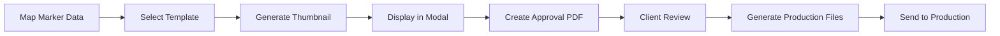

# Sign Production Pipeline

## Overview

The sign template system integrates with Mapping Slayer to generate ADA-compliant signage from map marker data.

## Core Components

### 1. Template Creation System (sign-template-maker.html)

- **Purpose**: Define reusable sign templates for different marker types
- **Features**:
    - Multi-message support (MSG1, MSG2, MSG3, etc.)
    - Individual message area positioning and sizing
    - Font selection and sizing per template
    - ADA-compliant text formatting (visual all caps, lowercase braille)
    - Braille translation with LibLouis Grade 2
    - Per-message braille configuration
    - Sign dimensions (pixels and inches)
    - Text wrapping with justification (left/center/right, top/middle/bottom)
    - Custom font upload support
    - Draggable message areas for precise positioning

### 2. Thumbnail Generation

- **Purpose**: Create preview images of signs using marker data
- **Process**:
    - Pull text data from map markers
    - Apply appropriate template based on marker type
    - Generate small preview SVG/images
    - Display in modal alongside gallery for quick review
- **Integration Point**: Mapping Slayer marker data → Template engine

### 3. Thumbnail Sheet PDFs (Client Approval)

- **Purpose**: Present all signs for client review
- **Format**:
    - Grid layout of thumbnail previews
    - Include marker IDs and location references
    - Add legend/index for navigation
    - Export as PDF for email/print review
- **Use Case**: Batch approval before production

### 4. Production File Generation

- **Purpose**: Create print-ready files after client approval
- **Requirements**:
    - Full-scale dimensions from templates
    - Maintain exact sizing (e.g., 8" x 8" at 100 DPI)
    - Include production marks (crop marks, bleed areas)
    - Export formats: PDF, SVG, or format specific to production method
- **Variants**:
    - Vinyl cutting files
    - Print files with color profiles
    - Braille embossing templates
    - Layered files for multi-process production

## Technical Implementation

### Current Status

- ✅ Text wrapping engine complete
- ✅ LibLouis Grade 2 braille integration working
- ✅ ADA compliance (lowercase braille conversion)
- ✅ SVG generation with D3.js
- ✅ Font metrics calculation for precise sizing

### Next Steps

1. **Template Storage System**
    - Save/load template configurations
    - Associate templates with marker types
    - Version control for template updates

2. **Data Integration**
    - Connect to Mapping Slayer marker data
    - Create API for pulling marker information
    - Map marker fields to template variables

3. **Batch Processing**
    - Generate multiple thumbnails efficiently
    - Queue system for large batches
    - Progress indicators

4. **PDF Generation**
    - Implement grid layout system
    - Add pagination for large sets
    - Include metadata and indices

## File Structure

```
sign-template-maker/
├── text-wrap-manual.html     # Template engine and preview
├── lib/
│   └── liblouis/             # Braille translation library
│       ├── build-no-tables-utf16.js
│       ├── easy-api.js
│       └── tables/           # Braille translation tables
├── braille-grade2.js         # Fallback braille translator
├── BRAILLE.TTF              # Braille font for rendering
└── templates/               # (TO CREATE) Saved sign templates
    ├── room-sign.json
    ├── directory.json
    └── emergency.json
```

## Workflow



## Key Features Implemented

### LibLouis Braille Translation

- Full dependency chain loaded (10 table files)
- Grade 2 contracted braille
- Automatic lowercase conversion for ADA compliance
- Fallback to JavaScript translator if LibLouis fails

### Text Processing

- Manual text wrapping to fit sign dimensions
- Horizontal and vertical centering
- Cap height calculations for ADA compliance (5/8" minimum)
- Letter and word spacing adjustments

### Sign Specifications

- Configurable dimensions in pixels and inches
- DPI settings for accurate scaling
- Visual rulers for measurement verification
- Braille positioning per ADA standards (0.4" below text)

## Integration Points

### With Mapping Slayer

- Read marker data: `marker.label`, `marker.type`, `marker.customFields`
- Template selection based on `marker.type`
- Batch operations for multiple markers

### With Thumbnail Slayer

- Generate thumbnail images
- Store in gallery system
- Link thumbnails to markers

### With Design Slayer

- Import custom graphics/logos
- Advanced template editing
- Color and material specifications

## Production Specifications

### ADA Requirements

- Minimum character height: 5/8" (0.625")
- Braille dot height: 0.239"
- Braille positioning: 3/8" - 1/2" below text
- High contrast colors
- Non-glare surfaces

### File Formats

- **Preview**: PNG/JPG thumbnails at 150 DPI
- **Approval**: PDF with embedded fonts
- **Production**:
    - SVG for vinyl cutting
    - PDF/X-4 for printing
    - DXF for CNC routing
    - Separate layers for multi-color/process

## Development Roadmap

### Phase 1: Template System ✅

- Basic template creation
- Text and braille rendering
- Manual preview generation

### Phase 2: Integration (IN PROGRESS)

- Connect to Mapping Slayer data
- Thumbnail modal implementation
- Template storage/retrieval

### Phase 3: Batch Processing (TODO)

- Multiple sign generation
- PDF sheet creation
- Progress tracking

### Phase 4: Production Output (TODO)

- Full-scale file generation
- Production marks and specs
- Export to various formats

### Phase 5: Advanced Features (FUTURE)

- Template versioning
- Multi-language support
- Custom braille tables
- Material/color specifications
- Cost estimation

## Notes

### Console Testing

- Server runs on port 8081: `npx http-server -p 8081 -c-1`
- Access at: `http://localhost:8081/sign-template-maker/text-wrap-manual.html`
- Chrome debug mode: `--remote-debugging-port=9222`

### Known Issues

- None currently - LibLouis loading issues resolved

### Recent Fixes

- Added all LibLouis table dependencies
- Implemented automatic lowercase conversion for braille
- Fixed virtual filesystem table loading

## Contact & Questions

This system is part of the Slayer Suite ecosystem, designed to streamline the complete sign production workflow from initial mapping to final production files.
